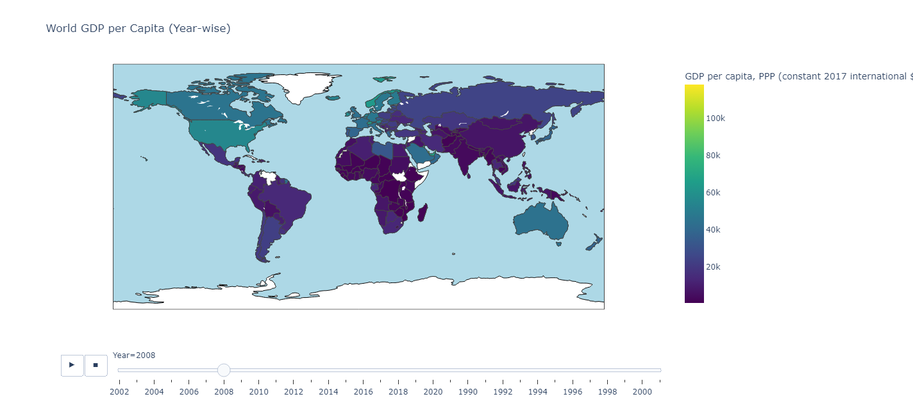
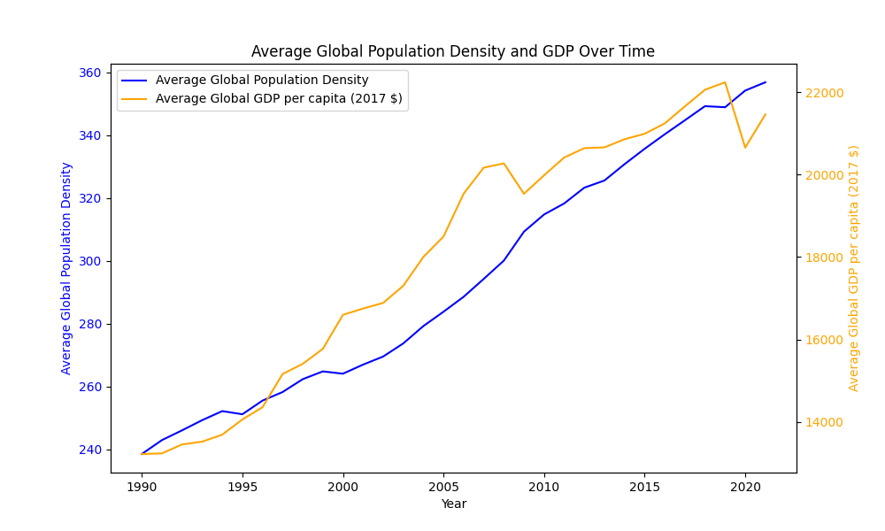
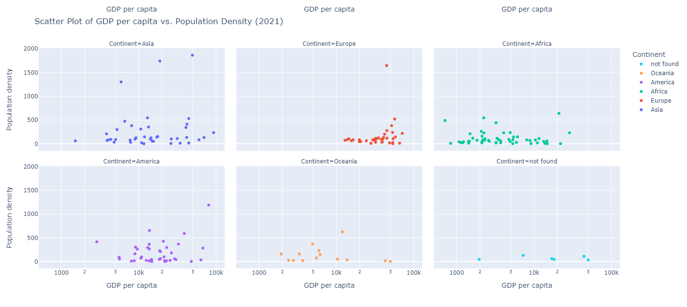

# ENDG 310
## Project #1 - Visualizing Data
Author: YUSUF BASHIR YUSUF

 EXPLORING THE EVOLUTION OF GLOBAL PROSPERITY: How has the Relationship Between Population Density and GDP Changed Over the Year?

The primary objective was to effectively illustrate the progression of global prosperity by examining the dynamic relationship between population density and GDP across the world over the course of multiple years. To achieve this, I designed a set of three visual representations to distinctly convey various aspects of this intricate relationship.

The first visualization takes the form of a choropleth map that divides the world into individual countries, employing a color gradient to represent each country's GDP per capita. This interactive map empowers users to navigate through different years and observe the changing GDP per capita of each nation as time unfolds. Furthermore, hovering over specific countries provides users with detailed information, offering a more granular understanding of the data at their fingertips.

The second graph illustrates the fluctuations in global average population density and GDP over a span of years. This graphical representation features two line charts that succinctly display the trends in both average population density and GDP over time. Unlike the first interactive graph, this visualization was created using Matplotlib and is static in nature.

The third visualization provided is a scatter plot with multiple facets, and it's designed to illustrate the relationship between GDP per capita and population density for various countries across different continents in the year 2021. By providing facets for different continents, it allows viewers to discern regional variations in this relationship. The use of logarithmic scaling and facet grouping contributes to a more informative and interpretable presentation of the data. The graph is interactive and so when hovering over a data point, the user can see additional details.

References: 
Population density. (2022). Our World in Data. https://ourworldindata.org/grapher/population-density?tab=table
GDP per capita. (2022). Our World in Data. https://ourworldindata.org/grapher/gdp-per-capita-maddison?tab=table

